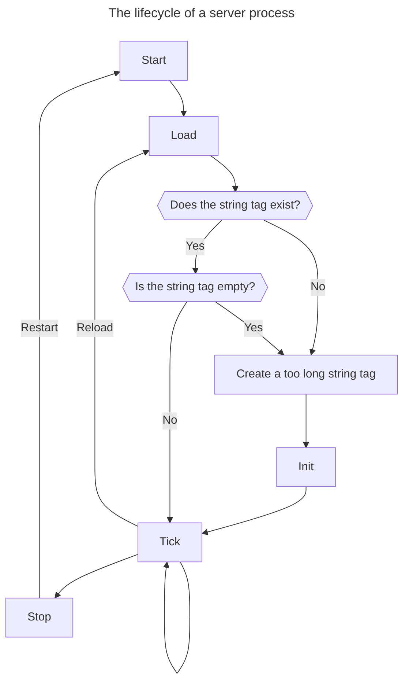

# <samp>init</samp>

This data pack provides `#minecraft:init` function tag, called on the initial `#minecraft:load` after server process startup.

> [!CAUTION]
> This data pack strongly depends on the internal implementation details of Minecraft and may not work in future versions!

> [!WARNING]
> An error message about `UTFDataFormatException` is printed every time a world is saved.
> You can safely ignore this message.

## How it works

A string tag larger than 65535 bytes can exist in memory with no problem.
However, when it is tried to be saved to a command storage file, a `UTFDataFormatException` occurs and an empty string is saved instead by `StringFallbackDataOutput`.
Once this happens, the string tag becomes out of sync between in-memory (too long) and on-file (empty).
Since the same command storage file is never loaded more than once during the lifetime of the server process, this out of sync will continue until the server is stopped.
When the server process is started again, an empty string tag is loaded from the command storage file.

In light of the above, `#minecraft:init` can be implemented as follows:

